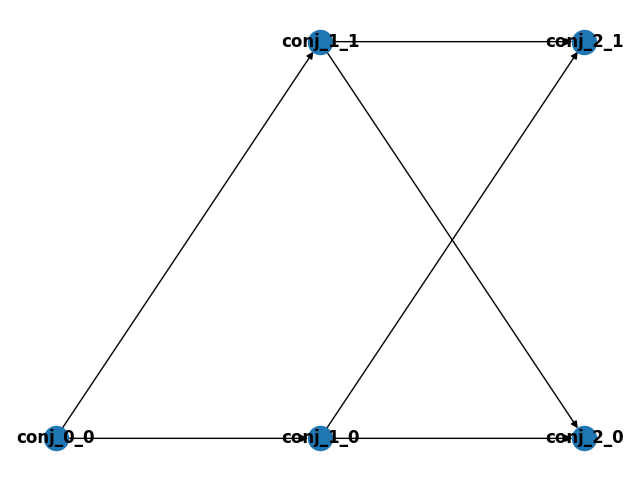

# Grew Disjunctive Patterns and Rules

Disjunctive patterns (and rules) are a python combinatorial tructure of grew patterns (or rules). It consists of python classes and fonctions allowing one to write grew pattern and command snippets, and organise them in a disjunctive way in order to generate a grs file containing all possible combinations.

These classes are implemented in the `classes.py` file. It uses the python libraries `networkx` and `matplotlib.pyplot`.

---
## Snippet

A snippet is an object of class `Snippet`. It has the following records:
 * `name:str` (mandatory)
 * `pattern:str`, a grew pattern
 * `command:str`, a grew command

**Warning:** Here, patterns have to be contained in a `pattern { }` envronment (and so, the record can contain `without { }` statements), whereas command should not be contained in a `command { }` environment.

Example:
```python
conj_0_0 = cl.Snippet("conj_0_0")
conj_0_0.pattern = '''pattern { P1 -[conj]-> P2 ; C[IntClause="Yes"] }'''
```

---
## DisjPat

A disjunctive pattern (class `DisjPat`) is a rooted directed acyclic graph where nodes are snippets. Additionally to class `networkx.DAG`, it has the following records:
 * `rule_name:str` (mandtory)
 * `root:Snippet` (mandatory)

### Adding nodes and arcs

Nodes and arcs can be added using `networkx` native methods. We provide an additional function to add snippets by layers.

Function `DisjPat.add_snippet(self, snippets:list, dep:Snippet)` allows to add all snippets in `snippets` to `self` the following way:
 * for element `v` of `snippets`
   * add node `v` to graph `self`
   * for every leaf `u` of `self` having `dep` as ancestor (or `dep == v`)
     * add node  arc `u -> v` 
Said differently, this function adds all elements of `snippets` as sucessors of all leaves having `dep` as last common ancestor.

Example:
```python
conj = cl.DisjPat("conj", root = conj_0_0)
conj.add_snippets([conj_1_0, conj_1_1], conj_0_0)
conj.add_snippets([conj_2_0, conj_2_1], conj_0_0)
```

This previous code with produce a DAG like this :



This graph can be obtained using the `.draw()` method.

### Generating branches

The function `DisjPat.gen_branches(self, output="rule")` returns the list of all branches of `self`.

For example, the branches of `conj` are 
```
[conj_0_0, conj_1_0, conj_2_0]
[conj_0_0, conj_1_0, conj_2_1]
[conj_0_0, conj_1_1, conj_2_0]
[conj_0_0, conj_1_1, conj_2_1]
```

Actually, instead of return a branch as a list of nodes, the function concatenates the patterns and the command records of these nodes and combine them into a grew rule. Thus, the output of `gen_branches` is a list of strings.

If `output=pattern` is given instead, only `pattern` records are concatenated to output a grew pattern (e.g. for grew grep / grew match).

### Generating a grs file

The function `gen_grs(seq:list, name:str, output="rule")` generates a file named `name.grs`. For every DisjPat named `rule_name` in `seq`, this function creates a package `pkg_rule_name` containing all rules corresponding to all branches of this DisjPat (indexed from 0), and a strategy
```
strat rule_name { Onf(Seq(pkg_rule_name)) }
```
At the end file, the `main` strategy, sequence of all strategies above, is added.

Note that the order of DisjPats matters in `seq`.

### Additional notes

Characters that require an escape in grew require here a double escape, e.g. `N[form="\\""]`.

DisjPat rule names are recommanded to be formatted as followed: `name_i_j_k`
 * `i` is the layer number, ex. `0` is the root
 * `j` is the place in the layer
 * `k` is an optional vertical offset. If `_k` is not given, `k` is 0 by default.

These numbers are detected by the `.draw()` method to display the graph correcty.
